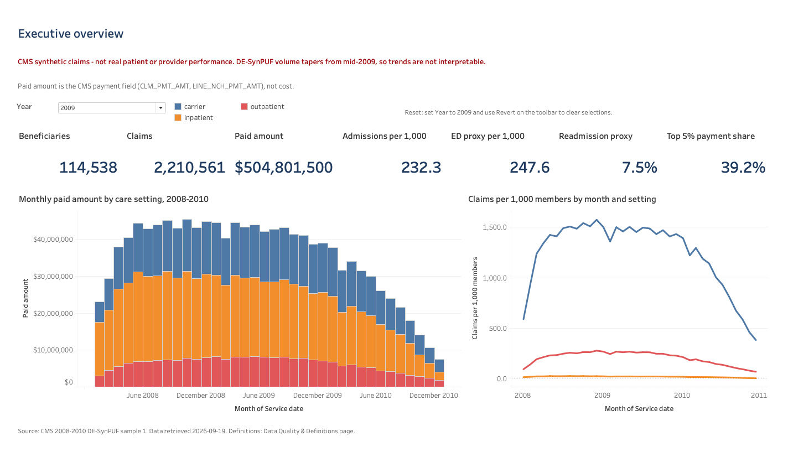
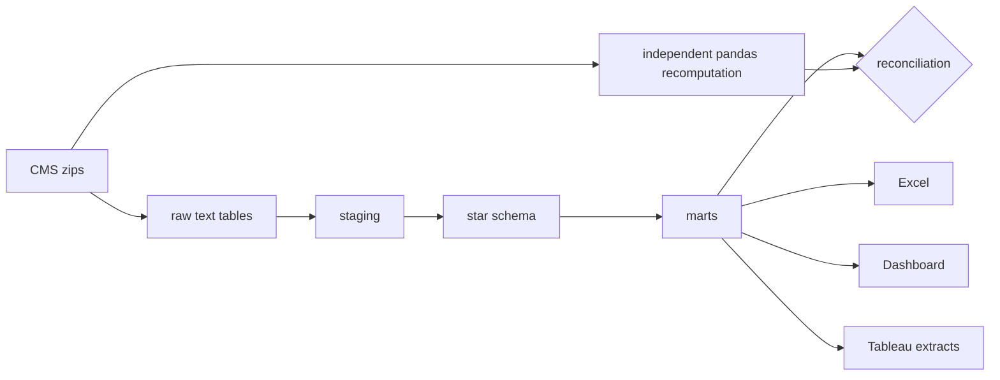

# Medicare Claims Utilization, Payment & Quality Analytics | CMS DE-SynPUF

[](https://github.com/VijayChamakuri/medicare-claims-utilization-cost-quality/actions/workflows/ci.yml)
[](LICENSE)
[](pyproject.toml)

> **CMS synthetic claims - not real patient or provider performance.** Every result here is a pipeline demonstration on CMS DE-SynPUF synthetic data.

## Business problem

Where are utilization and paid-amount patterns concentrated across synthetic beneficiaries, care settings, conditions and providers, and which operational segments should a payer or provider analytics team review first?

This is an analytics and BI project, not a modeling contest. It turns synthetic Medicare inpatient, outpatient and carrier claims into a tested SQL star schema with a dbt layer, a governed KPI contract, a formula-driven Excel operations workbook, a generated Tableau workbook and an offline HTML dashboard. Payment fields keep their CMS names (`CLM_PMT_AMT`, `LINE_NCH_PMT_AMT`); they are Medicare trust fund payments, not costs or charges.

**Tableau Public:** [vijay.chamakuri / Medicare Claims Utilization, Payment & Quality Analytics](https://public.tableau.com/app/profile/vijay.chamakuri/viz/MedicareClaimsUtilizationPaymentQualityAnalyticsCMSDE-SynPUF/ExecutiveOverview) (five dashboards).



Tableau screenshots: [utilization and payment](tableau/screenshots/02_utilization_payment.png), [provider operations](tableau/screenshots/03_provider_operations.png), [quality and cohorts](tableau/screenshots/04_quality_cohorts.png), [data quality and definitions](tableau/screenshots/05_data_quality_definitions.png). An offline HTML version is in [`dashboard/index.html`](dashboard/index.html) (one file, five pages). Screenshots: [utilization](dashboard/screenshots/02_utilization_payment.png), [provider operations](dashboard/screenshots/03_provider_operations.png), [quality and cohorts](dashboard/screenshots/04_quality_cohorts.png), [data quality and definitions](dashboard/screenshots/05_data_quality_definitions.png).

## Three verified synthetic-sample results

Computed from CMS DE-SynPUF sample 1 (about 5.6 million claims). Each is checked by the reconciliation and independent recomputation described below.

<!-- BEGIN generated:results -->
1. **Payment is concentrated.** In 2009, the top 5% of synthetic beneficiaries (5,727 of 114,538) held 39.2% of the paid amount ($197.9M of $504.8M).
2. **Inpatient stays drive payment, not volume.** In 2009, inpatient claims were 1.1% of claims but 48.6% of the paid amount; carrier (professional) claims carried 32.7% and outpatient 18.7%.
3. **A simple prior-year tier separates utilization.** In 2009, the high utilization risk tier was 17.5% of beneficiaries but 42.7% of the paid amount, with 528 admissions per 1,000 member-years against 91 in the low tier.
<!-- END generated:results -->

<!-- BEGIN generated:kpis -->
| Year | Beneficiaries | Claims | Paid amount | Admissions per 1,000 | ED proxy per 1,000 | Readmission proxy | Top 5% payment share |
|---|---:|---:|---:|---:|---:|---:|---:|
| 2008 | 116,352 | 2,025,978 | $483.3M | 245 | 210 | 15.1% | 48.5% |
| 2009 | 114,538 | 2,210,561 | $504.8M | 232 | 248 | 7.5% | 39.2% |
| 2010 | 112,754 | 1,350,500 | $286.7M | 128 | 132 | 4.3% | 43.1% |
<!-- END generated:kpis -->

Monthly volume in the synthetic source tapers from mid-2009, so year-over-year comparisons are not interpretable. Read the table as a demonstration of the metrics, not as a trend.

## Data source and caveat

Official CMS 2008-2010 [DE-SynPUF](https://www.cms.gov/data-research/statistics-trends-and-reports/medicare-claims-synthetic-public-use-files/cms-2008-2010-data-entrepreneurs-synthetic-public-use-file-de-synpuf), sample 1: beneficiary summaries for three years plus inpatient, outpatient and carrier claims. URLs, retrieval date, sizes and SHA-256 hashes for every file, the codebook and the FAQ are in [`data/data_manifest.json`](data/data_manifest.json); downloads are verified and a changed file stops the run. Diagnosis grouping uses AHRQ CCS 2015 for ICD-9-CM (2008 to 2010 claims are ICD-9 era).

DE-SynPUF is synthetic and intended for development and training. It cannot estimate real Medicare rates, provider performance, savings or prevalence.

## Architecture



Star schema: `dim_beneficiary`, `dim_date`, `dim_provider`, `dim_diagnosis`, `dim_procedure`, `dim_care_setting`; `fact_claim_header` (one row per claim), `fact_claim_line`, `fact_claim_diagnosis`, `fact_inpatient_stay`, `fact_beneficiary_year`; utilization, payment, quality, condition and provider marts. Grain and keys for every table: [table inventory](docs/table_inventory.md). Detail: [architecture](docs/architecture.md), [source to target mapping](docs/source_to_target_mapping.md).

## Reproduce

```bash
git clone https://github.com/VijayChamakuri/medicare-claims-utilization-cost-quality.git && cd medicare-claims-utilization-cost-quality
uv sync --extra dev
make fixture      # hand-calculated fixture pipeline, no download, under a minute
```

For the real sample (about 275 MB download including the codebook and FAQ, roughly 2 to 3 minutes to build on an Apple silicon laptop):

```bash
make all          # download and verify, build, dbt build and equivalence, validate, export, Excel and PDF, reports, Tableau workbook, dashboard
```

Requires Python 3.11 or 3.12 and `uv`. Stages can run alone: `download`, `build`, `dbt`, `validate`, `export`, `excel`, `reports`, `tableau`, `dashboard`, `readme`. `make fixture-all` runs every stage, including dbt, on the fixture. Switching to another CMS sample is a change to `config/project.yml`.

## Model and metrics

Every KPI has one contract entry in `config/metric_dictionary.yml`: owner role, grain, source model, calculation, numerator, denominator, inclusions, exclusions, valid dimensions, quality checks and known limits. The [metric dictionary](docs/metric_dictionary.md), the Excel and Tableau definitions and `tableau/expected_kpis.csv` are generated from it. Change rules: [metric governance](docs/metric_governance.md).

- **Utilization:** claims, inpatient admissions (continuous stays), an ED visit proxy (HCPCS 99281 to 99285), outpatient visits and carrier service lines, per 1,000 member-years.
- **Payment:** paid amount by setting, per beneficiary, per claim and per admission, and payment concentration in the top 5 percent of beneficiaries.
- **Quality monitoring:** a measure-inspired 30-day all-cause readmission proxy with explicit index and exclusion logic. Not a certified measure.
- **Risk tier:** a transparent points score from prior-year chronic condition flags, admissions and paid amount. It is a descriptive stratification, not CMS-HCC or any official risk adjustment.
- **Provider review flags:** a provider sitting above the interquartile fence of same-type peers. A prompt to review, never a finding about fraud or quality.

## dbt layer

`dbt/` holds 35 models generated from the validated SQL by `scripts/gen_dbt_models.py`, with grain, key, relationship and accepted-values tests, the blocking reconciliations as singular tests, and exposures for the Tableau workbook, Excel review and executive summary. `make dbt` builds it into its own schema and compares every model with the legacy SQL table row for row, then the headline KPIs ([`reports/dbt_equivalence.csv`](reports/dbt_equivalence.csv)). The legacy SQL runner stays the default build ([decision log](docs/decision_log.md)).

## Tableau and Excel artifacts

- **Excel:** [`excel/claims_operations_review.xlsx`](excel/claims_operations_review.xlsx) has nine sheets built from the marts, with live formulas for every rate, filters, freeze panes, conditional flags, print setup and a reconciliation sheet that ties workbook totals to DuckDB. No beneficiary rows. The executive summary sheet exports to a two-page PDF: [`reports/claims_executive_summary.pdf`](reports/claims_executive_summary.pdf).
- **Tableau:** [`tableau/workbook/medicare_claims_bi.twbx`](tableau/workbook/medicare_claims_bi.twbx) is a five-dashboard workbook generated from code with one Hyper extract per data source (aggregates and synthetic provider IDs only). It opens in Tableau Public 2026.2.2 with no errors, every KPI in its extract ties to the marts ([`tableau/validation_evidence.csv`](tableau/validation_evidence.csv)), all five dashboards were checked visually, and it is published on [Tableau Public](https://public.tableau.com/app/profile/vijay.chamakuri/viz/MedicareClaimsUtilizationPaymentQualityAnalyticsCMSDE-SynPUF/ExecutiveOverview). See [`tableau/README.md`](tableau/README.md).
- **Stakeholder outputs:** [executive summary](reports/executive_summary.md) (what stands out, actions, evidence, limits, what to validate), [stakeholder question map](docs/stakeholder_question_map.md), [provider action list](reports/provider_action_list.csv) (synthetic review flags), [data quality report](reports/data_quality_report.md).

## Tests and validation

- **Hand-calculated fixture.** Twelve beneficiaries, three settings, with transfers, deaths, readmissions inside and outside 30 days, duplicate rows, two-segment claims, malformed codes, negative payments and out-of-window claims. Every headline KPI is asserted exactly against values derived by hand ([derivation](tests/fixtures/README.md)), never from pipeline output.
- **SQL reconciliation.** Raw to staging to facts to marts, header to lines, keys and dates, with blocking checks that stop the run.
- **Independent recomputation.** [`validation.py`](src/medicare_claims/validation.py) recomputes claims, payments, admissions, ED proxy, readmission proxy and concentration in pandas from the raw CSVs, sharing no SQL. Money agrees to the cent. Tests tamper with the warehouse and confirm the checks fail.
- **dbt tests and equivalence.** 100 dbt tests, and every dbt model matches its legacy table row for row on the fixture and on sample 1.
- **Tableau package tests.** Manifest integrity, disclaimers on every dashboard, no beneficiary or claim identifiers in any extract, no "cost" label on payment metrics, and a KPI tie-out against the packaged Hyper extract that fails on drift.
- **CI** on Python 3.11 and 3.12 runs Ruff, mypy, pytest, the fixture pipeline with dbt build and equivalence, Excel structure and reconciliation, the Tableau package checks, and README drift. `make test` runs the same checks locally.

## Limitations

Synthetic data throughout. Monthly volume tapers in the source, so trends are not interpretable. The beneficiary summary reimbursement fields do not tie to claim payments and are not used. There is no discharge status, place of service or planned-readmission flag, so the readmission and ED measures are proxies. Prescription drug events are not loaded. Provider flags mostly reflect facility size on this data. No claim of savings, outcomes, fraud detection, HEDIS or CMS-HCC, HIPAA compliance or Epic experience is made, and the Tableau workbook is a synthetic-data demonstration, not an operational report. See [limitations](docs/limitations.md), [code mapping and limits](docs/code_mapping_and_limits.md) and [privacy and governance](docs/privacy_and_governance.md).

Code is MIT licensed. See [CONTRIBUTING](CONTRIBUTING.md).
