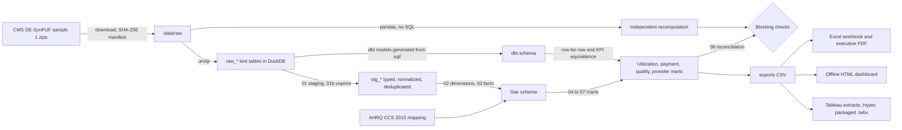
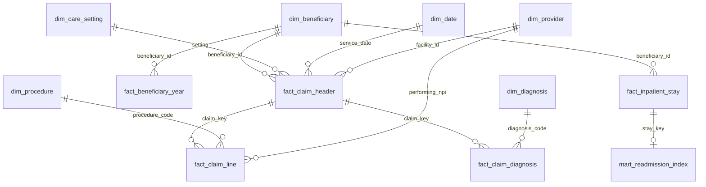

# Architecture

> CMS synthetic claims - not real patient or provider performance.

## Layers

1. **Raw.** Every source value is loaded as text so nothing is altered before staging. Fixture files may be narrow; missing columns load as NULL and files missing a required column are rejected.
2. **Staging (`sql/01_staging.sql`, `01b_staging_unpivot.sql`).** Types, normalizes codes, drops exact duplicate rows, and unpivots wide columns (10 diagnoses, 45 HCPCS positions, 13 carrier line groups). `01b` is generated by `scripts/gen_wide_sql.py`.
3. **Model (`02`, `03`).** Dimensions and claim facts. The claim key is beneficiary plus `CLM_ID`; CMS `SEGMENT` records (at most two) merge into one claim.
4. **Marts (`04` to `07`).** Member months, utilization, payment, quality proxies, risk tiers, provider review flags.
5. **Reconciliation (`08` and `validation.py`).** SQL checks that stop the run, plus an independent pandas recomputation.
6. **dbt layer (`dbt/`).** `scripts/gen_dbt_models.py` turns every statement in `sql/` into a dbt model with `ref()`, `source()` and vars, so dbt runs exactly the validated logic. dbt adds grain, key, relationship and accepted-values tests, the blocking reconciliations as singular tests, and exposures for the Tableau workbook, Excel review and executive summary. `medicare-claims dbt` builds it into schema `dbt` and compares every model with the legacy table row for row, then the headline KPIs. The legacy SQL path stays the default build until a deliberate switch; see the [decision log](decision_log.md).
7. **Consumers.** Excel, the offline dashboard and the Tableau package all read the same aggregated datasets (`export.py`, `tableau.py`). The Tableau workbook is written as XML by `src/medicare_claims/twb.py` and packaged with one Hyper extract per data source.

## Star schema

Grain, keys and row counts for every table: [table inventory](table_inventory.md). Field mappings: [source to target](source_to_target_mapping.md).

## Why DuckDB

It runs the whole 5.6 million claim warehouse on a laptop from one file, needs no credentials, and makes CI and a fresh clone simple. The SQL uses a few DuckDB functions (`unnest` of struct lists, `qualify`, `quantile_cont` as a window), so another warehouse would need a dialect pass. It has not been executed on any other warehouse.

## Scale

Sample 1 builds in about two minutes on a laptop. Adding CMS samples 2 to 20 means adding entries to `config/project.yml`; the SQL and Python do not change. This repository has processed sample 1 only.
