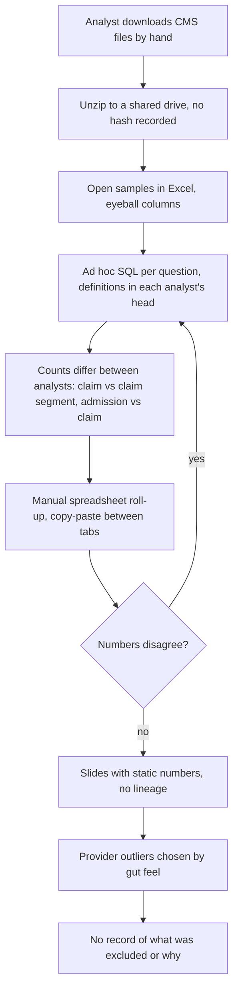
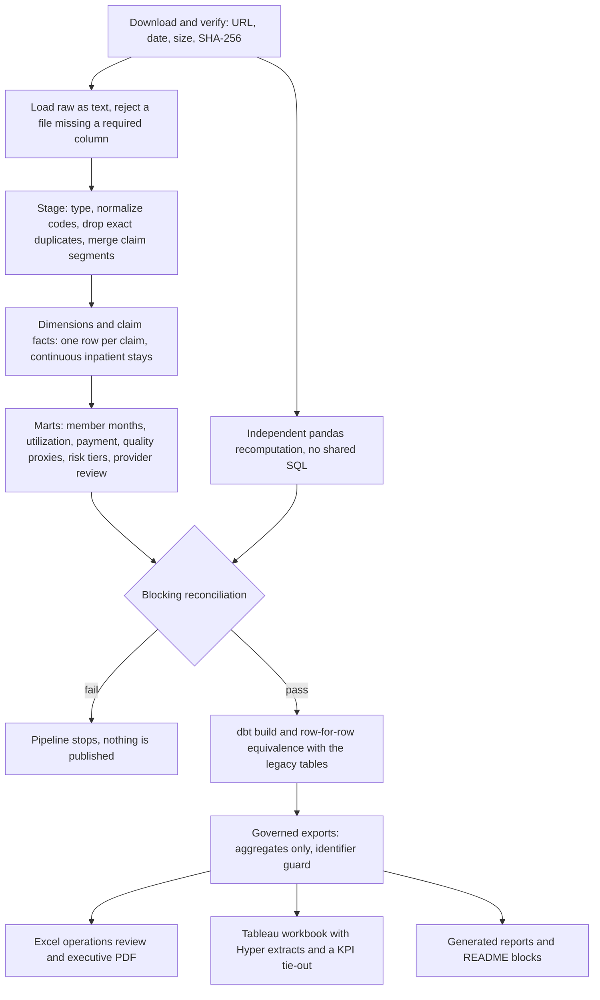

# Process map: claims intake to payment analysis

> CMS synthetic claims - not real patient or provider performance.

The as-is map is the manual equivalent this project replaces: a spreadsheet-and-ad-hoc-query process. The to-be map is what this repository does today, and every automated step names the file that implements it. Both are drawn for a payer claims operations team working with a CMS extract.

## As-is

Pain points: no pinned source version, duplicate claim segments counted twice, no shared definition of a stay or an analytic claim, no exclusion log, no gate that stops a bad number before it reaches a slide.

## To-be

## Step to implementation

| To-be step | Implemented by | Control that proves it |
|---|---|---|
| Download and verify | `src/medicare_claims/download.py`, `data/data_manifest.json` | `tests/test_download.py::test_manifest_records_url_date_size_and_hash` |
| Load raw as text | `src/medicare_claims/ingest.py` | `tests/test_ingest.py::test_all_values_are_loaded_as_text_without_loss` |
| Stage and deduplicate | `sql/01_staging.sql`, `sql/01b_staging_unpivot.sql` | `tests/test_claim_grain.py::test_exact_duplicate_rows_are_dropped_once` |
| Merge claim segments | `sql/03_claim_facts.sql` | `tests/test_claim_grain.py::test_header_has_one_row_per_claim_and_segments_are_merged` |
| Continuous inpatient stays | `sql/03_claim_facts.sql` | `tests/test_claim_grain.py::test_transfer_claims_continue_one_stay` |
| Member months | `sql/04_utilization_mart.sql` | `tests/test_fixture_kpis.py::test_member_month_eligibility` |
| Quality proxies | `sql/06_quality_mart.sql` | `tests/test_fixture_kpis.py::test_readmission_proxy_index_and_exclusion_logic` |
| Provider review flags | `sql/07_provider_mart.sql` | `tests/test_fixture_kpis.py::test_provider_review_flags_use_peer_quartiles` |
| Blocking reconciliation | `sql/08_reconciliation.sql`, `src/medicare_claims/model.py` | `tests/test_reconciliation.py::test_blocking_checks_pass_on_the_fixture` |
| Independent recomputation | `src/medicare_claims/validation.py` | `tests/test_reconciliation.py::test_independent_pandas_recomputation_agrees_within_tolerance` |
| dbt build and equivalence | `dbt/`, `src/medicare_claims/dbt_layer.py` | `reports/dbt_equivalence.csv`, `tests/test_dbt_project.py::test_generated_models_match_sql` |
| Governed exports | `src/medicare_claims/export.py` | `tests/test_pipeline_e2e.py::test_exports_are_aggregates_only_and_match_hand_values` |
| Excel review and PDF | `src/medicare_claims/excel.py`, `src/medicare_claims/pdf_export.py` | `tests/test_excel.py::test_reconciliation_sheet_ties_workbook_totals_to_duckdb` |
| Tableau workbook | `src/medicare_claims/tableau.py`, `src/medicare_claims/twb.py` | `tableau/validation_evidence.csv`, `tests/test_tableau_package.py::test_hyper_tieout_passes_for_every_kpi` |

## What the to-be map does not do

Adjudication itself is upstream and is not modeled: DE-SynPUF contains already-adjudicated claims, so there is no denial, appeal or remittance step. There is no discharge status, place of service or planned-readmission flag, so the ED and readmission steps are proxies. Prescription drug events are out of scope ([business requirements](business_requirements.md)).
